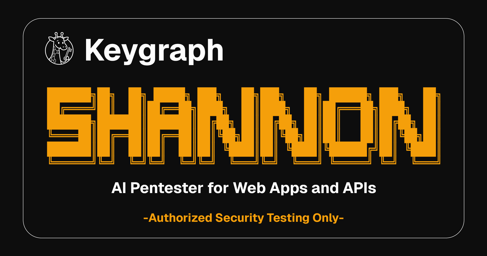
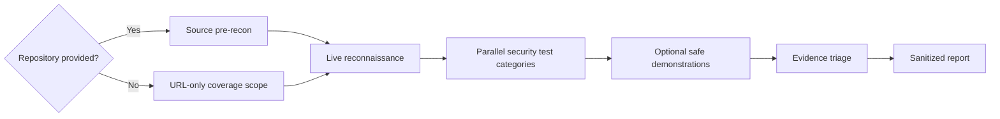

>[!NOTE]
> **[📢 Sunsetting Router Mode (claude-code-router)`. →](https://github.com/KeygraphHQ/shannon/discussions/301)**

<div align="center">



# Shannon — AI Pentester by Keygraph

<a href="https://trendshift.io/repositories/15604" target="_blank"></a>

Shannon is an autonomous security assessment system for web applications and APIs. <br />
Run URL-only dynamic testing, or add a repository for source-assisted coverage and code-location context.

---

<a href="https://discord.gg/9ZqQPuhJB7"></a>
<a href="https://keygraph.io/"></a>

---
</div>

## What is Shannon?

Shannon is an AI security testing system developed by [Keygraph](https://keygraph.io). It combines live browser and API testing with an evidence triage gate. A repository is optional: source-assisted assessments use code to guide the live test, while URL-only assessments operate exclusively through behavior observable at the authorized target.

Both modes run preflight, authentication validation, live reconnaissance, selected security test categories, optional safe demonstrations, triage, and reporting. URL-only reports explicitly disclose that implementation analysis and code-location coverage were unavailable.

**Why Shannon Exists**

Thanks to tools like Claude Code and Cursor, your team ships code non-stop. But your penetration test? That happens once a year. This creates a *massive* security gap. For the other 364 days, you could be unknowingly shipping vulnerabilities to production.

Shannon closes that gap by providing on-demand, automated penetration testing that can run against every build or release.

## Shannon in Action

Shannon identified 20+ vulnerabilities in OWASP Juice Shop, including authentication bypass and database exfiltration. [Full report →](sample-reports/shannon-report-juice-shop.md)


## Features

- **Two Assessment Modes**: Run against a URL alone, or provide a repository for source-assisted analysis and code-location context.
- **Local Operator UI**: Create reusable profiles, select security test categories, start/cancel/resume runs, follow live activity, triage findings, and download reports or evidence from a localhost-only interface.
- **Fully Autonomous Operation**: A single command launches the full assessment. Shannon handles 2FA/TOTP logins (including SSO), browser navigation, safe demonstrations, triage, and report generation without manual intervention.
- **Evidence-First Results**: Triage distinguishes confirmed, downgraded, ruled-out, chain-dependent, and unvalidated candidates before reporting.
- **OWASP Vulnerability Coverage**: Identifies and validates Injection, XSS, SSRF, and Broken Authentication/Authorization, with additional categories in development.
- **Code-Aware Dynamic Testing**: In source-assisted mode, source analysis guides live browser and API validation against the running application.
- **Parallel Processing**: Analysis and safe-demonstration pipelines run concurrently across selected categories.

## Product Line

Shannon is developed by [Keygraph](https://keygraph.io) and available in two editions:

| Edition | License | Best For |
|---------|---------|----------|
| **Shannon Lite** | AGPL-3.0 | Local testing of your own applications. |
| **Shannon Pro** | Commercial | Organizations needing a single AppSec platform (SAST, SCA, secrets, business logic testing, autonomous pentesting) with CI/CD integration and self-hosted deployment. |

> **This repository contains Shannon Lite,** the core autonomous AI pentesting framework. **Shannon Pro** is Keygraph's all-in-one AppSec platform, combining SAST, SCA, secrets scanning, business logic security testing, and autonomous AI pentesting in a single correlated workflow. Every finding is validated with a working proof-of-concept exploit.

> [!IMPORTANT]
> **URL-only mode has lower coverage than source-assisted mode.** It cannot inspect implementation-only attack surfaces, attribute findings to code locations, or prove that unobserved routes are absent. Shannon discloses these limits in the UI and every URL-only report.

### Shannon Pro: Architecture Overview

Shannon Pro is an all-in-one application security platform that replaces the need to stitch together separate SAST, SCA, secrets scanning, and pentesting tools. It operates as a two-stage pipeline: agentic static analysis of the codebase, followed by autonomous AI penetration testing. Findings from both stages are cross-referenced and correlated, so every reported vulnerability has a working proof-of-concept exploit and a precise source code location.

**Stage 1: Agentic Static Analysis**

Shannon Pro transforms the codebase into a Code Property Graph (CPG) combining the AST, control flow graph, and program dependence graph. It then runs five analysis capabilities:

- **Data Flow Analysis (SAST)**: Identifies sources (user input, API requests) and sinks (SQL queries, command execution), then traces paths between them. At each node, an LLM evaluates whether the specific sanitization applied is sufficient for the specific vulnerability in context, rather than relying on a hard-coded allowlist of safe functions.
- **Point Issue Detection (SAST)**: LLM-based detection of single-location vulnerabilities: weak cryptography, hardcoded credentials, insecure configuration, missing security headers, weak RNG, disabled certificate validation, and overly permissive CORS.
- **Business Logic Security Testing (SAST)**: LLM agents analyze the codebase to discover application-specific invariants (e.g., "document access must verify organizational ownership"), generate targeted fuzzers to violate those invariants, and synthesize full PoC exploits. This catches authorization failures and domain-specific logic errors that pattern-based scanners cannot detect.
- **SCA with Reachability Analysis**: Goes beyond flagging CVEs by tracing whether the vulnerable function is actually reachable from application entry points via the CPG. Unreachable vulnerabilities are deprioritized.
- **Secrets Detection**: Combines regex pattern matching with LLM-based detection (for dynamically constructed credentials, custom formats, obfuscated tokens) and performs liveness validation against the corresponding service using read-only API calls.

**Stage 2: Autonomous Dynamic Penetration Testing**

The same multi-agent pentest pipeline as Shannon Lite (reconnaissance, parallel vulnerability analysis, parallel exploitation, reporting), enhanced with static findings injected into the exploitation queue. Static findings are mapped to Shannon's five attack domains (Injection, XSS, SSRF, Auth, Authz), and exploit agents attempt real proof-of-concept attacks against the running application for each finding.

**Static-Dynamic Correlation**

This is the core differentiator. A data flow vulnerability identified in static analysis (e.g., unsanitized input reaching a SQL query) is not reported as a theoretical risk. It is fed to the corresponding exploit agent, which attempts to exploit it against the live application. Confirmed exploits are traced back to the exact source code location, giving developers both proof of exploitability and the line of code to fix.

**Deployment Model**

Shannon Pro supports a self-hosted runner model (similar to GitHub Actions self-hosted runners). The data plane, which handles code access and all LLM API calls, runs entirely within the customer's infrastructure using the customer's own API keys. Source code never leaves the customer's network. The Keygraph control plane handles job orchestration, scan scheduling, and the reporting UI, receiving only aggregate findings.

| Capability | Shannon Lite | Shannon Pro (All-in-One AppSec) |
| --- | --- | --- |
| **Licensing** | AGPL-3.0 | Commercial |
| **Static Analysis** | Code review prompting | Full agentic SAST, SCA, secrets, business logic testing |
| **Dynamic Testing** | Autonomous AI pentesting | Autonomous AI pentesting with static-dynamic correlation |
| **Analysis Engine** | Code review prompting | CPG-based data flow with LLM reasoning at every node |
| **Business Logic** | None | Automated invariant discovery, fuzzer generation, exploit synthesis |
| **CI/CD Integration** | Manual / CLI | Native CI/CD, GitHub PR scanning |
| **Deployment** | CLI | Managed cloud or self-hosted runner |
| **Boundary Analysis** | None | Automatic service boundary detection with team routing |

[Full technical details →](./SHANNON-PRO.md)

## Table of Contents

- [What is Shannon?](#what-is-shannon)
- [Shannon in Action](#shannon-in-action)
- [Features](#features)
- [Product Line](#product-line)
- [Setup & Usage Instructions](#setup--usage-instructions)
  - [Prerequisites](#prerequisites)
  - [Quick Start (Recommended: npx)](#quick-start-recommended-npx)
  - [Clone and Build](#clone-and-build)
  - [Choose an Assessment Mode](#choose-an-assessment-mode)
  - [Common Commands](#common-commands)
  - [Workspaces and Resuming](#workspaces-and-resuming)
  - [Credentials and Configuration](#credentials-and-configuration)
  - [AWS Bedrock](#aws-bedrock)
  - [Vertex AI Migration](#vertex-ai-migration)
  - [Custom Base URL](#custom-base-url)
  - [Platform-Specific Instructions](#platform-specific-instructions)
  - [Output and Results](#output-and-results)
- [Sample Reports](#sample-reports)
- [Benchmark](#benchmark)
- [Architecture](#architecture)
- [Coverage and Roadmap](#coverage-and-roadmap)
- [Disclaimers](#disclaimers)
- [License](#license)
- [Community & Support](#community--support)
- [Get in Touch](#get-in-touch)

---

## Setup & Usage Instructions

### Prerequisites

- **Docker** - Container runtime ([Install Docker](https://docs.docker.com/get-docker/))
- **Node.js 20.19+** - Required for `npx` usage and the local UI ([Install Node.js](https://nodejs.org/))
- **pnpm** - Required for Clone and Build mode ([Install pnpm](https://pnpm.io/installation))
- **AI Provider Credentials** (choose one):
  - **Anthropic API key** (recommended) - Get from [Anthropic Console](https://console.anthropic.com)
  - **Claude Code OAuth token**
  - **OpenAI API key**
  - **xAI API key**
  - **AWS Bedrock** - Route through Amazon Bedrock with AWS credentials (see [AWS Bedrock](#aws-bedrock))
  - **Custom or catalog provider** - Use a provider supported by the model runtime, optionally through a compatible gateway

> [!NOTE]
> Docker is still required to run assessments through `npx`. The CLI pulls a prebuilt Shannon worker image. In source-assisted mode the repository is mounted read-only with workspace-backed writable overlays; URL-only mode instead mounts an isolated writable target workspace. The local UI itself binds only to `127.0.0.1`.

### Quick Start (Recommended: npx)

> [!WARNING]
> **Please read the [Disclaimers](#disclaimers) before running Shannon.** Shannon is **not** a passive scanner — it actively executes exploits against the target. You must have **explicit, written authorization** from the system owner.

```bash
# 1. Configure credentials (interactive wizard — one-time setup)
npx @keygraph/shannon setup

# Or export env vars directly
export SHANNON_AI_MODEL=anthropic:claude-sonnet-4-6
# Load ANTHROPIC_API_KEY from your shell or secret manager.

# 2a. Run a URL-only assessment
npx @keygraph/shannon start -u https://your-app.com

# 2b. Or add a repository for source-assisted coverage
npx @keygraph/shannon start -u https://your-app.com -r /path/to/your-repo

# Open the local operator UI
npx @keygraph/shannon ui
```

Shannon will pull the worker image from Docker Hub, start the infrastructure, and launch an ephemeral worker container for the scan.

### Clone and Build

Use this if you want to run Shannon from a local clone, modify Shannon itself, or keep the worker image built locally.

```bash
# 1. Clone Shannon
git clone https://github.com/KeygraphHQ/shannon.git
cd shannon

# 2. Configure credentials (choose one method)

# Option A: Create a .env file
cat > .env << 'EOF'
SHANNON_AI_MODEL=anthropic:claude-sonnet-4-6
ANTHROPIC_API_KEY=your-api-key
CLAUDE_CODE_MAX_OUTPUT_TOKENS=64000
EOF

# Option B: Export environment variables
export SHANNON_AI_MODEL="anthropic:claude-sonnet-4-6"
export ANTHROPIC_API_KEY="your-api-key"              # or CLAUDE_CODE_OAUTH_TOKEN
export CLAUDE_CODE_MAX_OUTPUT_TOKENS=64000           # recommended

# 3. Install dependencies and build
pnpm install
pnpm build

# 4. Run an assessment, with or without a repository
./shannon start -u https://your-app.com
./shannon start -u https://your-app.com -r /path/to/your-repo

# Open the local operator UI
./shannon ui
```

Shannon will build the worker image locally, start the infrastructure, and launch an ephemeral worker container for the scan.

### Choose an Assessment Mode

Omit `-r` for URL-only dynamic testing. Pass an absolute or relative repository path with `-r` for source-assisted coverage.

Examples:

```bash
npx @keygraph/shannon start -u https://example.com -r /path/to/repo
npx @keygraph/shannon start -u https://example.com
```

<details>
<summary>Clone and Build command equivalents</summary>

```bash
./shannon start -u https://example.com -r ./relative/path
./shannon start -u https://example.com
```

</details>

### Common Commands

#### Monitoring Progress

```bash
npx @keygraph/shannon logs <workspace>
npx @keygraph/shannon status
npx @keygraph/shannon ui
```

Open the Temporal Web UI for detailed monitoring:

```bash
open http://localhost:8233
```

<details>
<summary>Clone and Build command equivalents</summary>

```bash
./shannon logs <workspace>
./shannon status
./shannon ui
```

</details>

#### Stopping Shannon

```bash
npx @keygraph/shannon stop
npx @keygraph/shannon stop --clean
npx @keygraph/shannon uninstall
```

<details>
<summary>Clone and Build command equivalents</summary>

```bash
./shannon stop
./shannon stop --clean
```

</details>

#### Usage Examples

```bash
# Basic pentest
npx @keygraph/shannon start -u https://example.com

# Source-assisted assessment
npx @keygraph/shannon start -u https://example.com -r /path/to/repo

# With a configuration file
npx @keygraph/shannon start -u https://example.com -r /path/to/repo -c /path/to/my-config.yaml

# Custom output directory
npx @keygraph/shannon start -u https://example.com -r /path/to/repo -o ./my-reports

# Named workspace
npx @keygraph/shannon start -u https://example.com -r /path/to/repo -w q1-audit

# List all workspaces
npx @keygraph/shannon workspaces

# Cancel or resume by immutable workspace snapshot
npx @keygraph/shannon cancel q1-audit
npx @keygraph/shannon resume q1-audit
```

<details>
<summary>Clone and Build command equivalents</summary>

```bash
# URL-only assessment
./shannon start -u https://example.com

# Source-assisted assessment
./shannon start -u https://example.com -r /path/to/repo

# With a configuration file
./shannon start -u https://example.com -r /path/to/repo -c /path/to/my-config.yaml

# Custom output directory
./shannon start -u https://example.com -r /path/to/repo -o ./my-reports

# Named workspace
./shannon start -u https://example.com -r /path/to/repo -w q1-audit

# List all workspaces
./shannon workspaces

# Rebuild worker image
./shannon build --no-cache
```

</details>

### Workspaces and Resuming

Shannon supports **workspaces** that allow failed or cancelled runs to resume without changing their original target, source mode, repository, or normalized configuration.

**How it works:**

- Every run creates a workspace (auto-named by default, for example `example-com_shannon-1771007534808`)
- Workspaces are stored in `./workspaces/` (local mode) or `~/.shannon/workspaces/` (npx mode)
- Use `-w <name>` to give your run a custom name for easier reference
- Resume with `shannon resume <workspace>`; completed agents and checkpoint artifacts are reused
- Target secrets are never stored in `.shannon/run.json` and must be resolved from stored references or supplied again on resume
- Each agent's progress is checkpointed via git commits, so resumed runs start from a clean, validated state

```bash
# Start with a named workspace
npx @keygraph/shannon start -u https://example.com -r /path/to/repo -w my-audit

# Resume the same workspace (skips completed agents)
npx @keygraph/shannon resume my-audit

# Cancel an active workspace
npx @keygraph/shannon cancel my-audit

# List all workspaces and their status
npx @keygraph/shannon workspaces
```

<details>
<summary>Clone and Build command equivalents</summary>

```bash
./shannon start -u https://example.com -r /path/to/repo -w my-audit
./shannon start -u https://example.com -r /path/to/repo -w my-audit
./shannon start -u https://example.com -r /path/to/repo -w example-com_shannon-1771007534808
./shannon workspaces
```

</details>

> [!NOTE]
> Resumes always use the immutable non-secret run snapshot. The target, source mode, repository, and normalized configuration cannot be changed during resume.

### Credentials and Configuration

#### Credential Precedence

**Local mode** resolves credentials from:

1. **Environment variables** - `SHANNON_AI_MODEL` and the selected provider's credential variable
2. **`.env` file** - `./.env`

**npx mode** uses TOML instead of `.env`:

1. **Environment variables** - `SHANNON_AI_MODEL` and the selected provider's credential variable
2. **`~/.shannon/config.toml`** - created by `npx @keygraph/shannon setup`

Environment variables always win, so you can override saved config for a single session without editing files.

#### Model and Provider Selection

`SHANNON_AI_MODEL` selects one model using the format `<provider>:<model-id>`. The provider is separated on the first colon, so model IDs may contain additional colons. The setup wizard writes this selection to `~/.shannon/config.toml` using a masked credential prompt and mode `0600` permissions.

| Setup option | `SHANNON_AI_MODEL` example | Accepted credential source |
| --- | --- | --- |
| Anthropic | `anthropic:claude-sonnet-4-6` | `ANTHROPIC_API_KEY`, `CLAUDE_CODE_OAUTH_TOKEN`, or `SHANNON_AI_API_KEY` |
| OpenAI | `openai:gpt-5.6-sol` | `OPENAI_API_KEY` or `SHANNON_AI_API_KEY` |
| xAI | `xai:grok-4.5` | `XAI_API_KEY` or `SHANNON_AI_API_KEY` |
| Amazon Bedrock | `amazon-bedrock:us.anthropic.claude-sonnet-4-6` | The standard AWS credential chain or `AWS_BEARER_TOKEN_BEDROCK` |
| Other catalog provider | `<provider>:<model-id>` | `SHANNON_AI_API_KEY` |

Run `npx @keygraph/shannon setup` for the recommended configuration flow. If you configure the environment directly, load the credential variable through your shell, CI, or secret manager; never put a credential in `SHANNON_AI_MODEL` or commit it to the repository.

```bash
export SHANNON_AI_MODEL=anthropic:claude-sonnet-4-6
# Inject ANTHROPIC_API_KEY through your secret manager before starting Shannon.
```

#### Configuration (Optional)

While you can run without a config file, creating one enables authenticated testing and customized analysis. Pass any configuration file path with `-c`.

##### Create Configuration File

Copy and modify the example configuration:

```bash
cp configs/example-config.yaml ./my-app-config.yaml
```

##### Basic Configuration Structure

```yaml
# Describe your target environment (optional, max 500 chars)
description: "Next.js e-commerce app on PostgreSQL. Local dev environment — .env files contain local-only credentials, not deployed to production."

# Limit which security test categories run end-to-end (optional, default: all five)
# test_categories: [injection, xss, auth, authz, ssrf]

# Disable safe demonstrations (optional, default: true)
# demonstrate: false

# Free-form rules of engagement (optional)
# rules_of_engagement: |
#   - No password brute-force; cap login attempts at 5 per account.
#   - Throttle to under 5 requests per second per endpoint; back off 60s on any 429.
#   - Use placeholders like [order_id] in deliverables — no real data values.

authentication:
  login_type: form
  login_url: "https://your-app.com/login"
  credentials:
    username: "test@example.com"
    password: "yourpassword"
    totp_secret: "LB2E2RX7XFHSTGCK"  # Optional for 2FA

    # Optional mailbox credentials for magic-link / email-OTP flows.
    # email_login:
    #   address: "inbox@example.com"
    #   password: "mailbox-password"
    #   totp_secret: "JBSWY3DPEHPK3PXP"

  # Natural language instructions for login flow
  login_flow:
    - "Type $username into the email field"
    - "Type $password into the password field"
    - "Click the 'Sign In' button"

  success_condition:
    type: url_contains
    value: "/dashboard"

rules:
  # Supported types: url_path, subdomain, domain, method, header, parameter.
  # code_path is additionally available in source-assisted mode.
  avoid:
    - description: "AI should avoid testing logout functionality"
      type: url_path
      value: "/logout"

    # code_path values are repo-relative file paths or globs (e.g. "src/auth.ts", "src/vendor/**").
    # - description: "Out-of-scope vendored libraries"
    #   type: code_path
    #   value: "src/vendor/**"

  focus:
    - description: "AI should emphasize testing API endpoints"
      type: url_path
      value: "/api"

# Filters applied by the report agent when assembling the final report (optional).
# report:
#   min_severity: low                   # drop findings below this severity (low | medium | high | critical)
#   min_confidence: low                 # drop findings below this confidence (low | medium | high)
#   guidance: |
#     Drop findings about missing security headers and rate-limit gaps.
```

Run with:

```bash
npx @keygraph/shannon start -u https://example.com -c ./my-app-config.yaml
npx @keygraph/shannon start -u https://example.com -r /path/to/repo -c ./my-app-config.yaml
```

<details>
<summary>Clone and Build command equivalents</summary>

```bash
./shannon start -u https://example.com -r /path/to/repo -c ./my-app-config.yaml
```

</details>

#### Writing Login Flow

Log in once in a fresh incognito/private window. Write the steps in the same order you perform them:
- When you type into a field, reference the field by its exact label or placeholder.
- When you click a button, reference the exact button text.

Supported placeholders:

- `$username`
- `$password`
- `$totp`
- `$email_address`
- `$email_password`
- `$email_totp`

At runtime, Shannon replaces these placeholders with the credentials passed in the config.

```yaml
login_flow:
  - "Type $username in <exact email field label or placeholder>"
  - "Click <exact button text>"
  - "Type $password in <exact password field label or placeholder>"
  - "Click <exact button text>"
  - "If prompted for 2FA, type $totp in <exact code field label or placeholder>"
  - "Click <exact button text>"
```

#### Adaptive Thinking (Opus 4.6/4.7)

Claude decides when and how deeply to reason on Opus 4.6 and 4.7. Enabled by default whenever a tier resolves to one of these models.

- **npx mode** — `npx @keygraph/shannon setup` prompts you during the wizard.
- **Local mode** — set `CLAUDE_ADAPTIVE_THINKING=false` in `.env` (or as an exported env var) to disable.

#### Subscription Plan Rate Limits

Anthropic subscription plans reset usage on a **rolling 5-hour window**. The default retry strategy (30-min max backoff) will exhaust retries before the window resets. Add this to your config:

```yaml
pipeline:
  retry_preset: subscription          # Extends max backoff to 6h, 100 retries
  max_concurrent_pipelines: 2         # Run 2 of 5 pipelines at a time (reduces burst API usage)
```

`max_concurrent_pipelines` controls how many vulnerability pipelines run simultaneously (1-5, default: 5). Lower values reduce the chance of hitting rate limits but increase wall-clock time.

### AWS Bedrock

Shannon also supports [Amazon Bedrock](https://aws.amazon.com/bedrock/) instead of using an Anthropic API key.

#### Quick Setup

Run `npx @keygraph/shannon setup` and select **AWS Bedrock**. The wizard will prompt for your region, bearer token, and one model ID.

Or export env vars directly:

```bash
export SHANNON_AI_MODEL=amazon-bedrock:us.anthropic.claude-sonnet-4-6
export AWS_REGION=us-east-1
# Load one supported AWS credential mechanism, such as AWS_PROFILE,
# workload identity, or AWS_BEARER_TOKEN_BEDROCK.
```

<details>
<summary>Clone and Build: add to .env instead</summary>

```bash
SHANNON_AI_MODEL=amazon-bedrock:us.anthropic.claude-sonnet-4-6
AWS_REGION=us-east-1
# Load credentials from outside the repository before starting Shannon.
```

</details>

The model ID must be available in the selected AWS region. Standard AWS profiles, access keys, container credentials, and web identity credentials are supported in addition to Bedrock bearer tokens.

### Vertex AI Migration

Google Vertex AI is not supported by Shannon's current model compatibility layer. It is no longer offered by `npx @keygraph/shannon setup`.

Legacy Vertex settings are rejected. The CLI and worker return migration guidance instead of forwarding Vertex credentials. Migrate to one of the supported provider setups above:

1. Remove the legacy Vertex variables or `[vertex]` section.
2. Run `npx @keygraph/shannon setup` and choose Anthropic, OpenAI, xAI, AWS Bedrock, or a compatible gateway.
3. For environment-based configuration, set `SHANNON_AI_MODEL=<provider>:<model-id>` and load the matching credential variable from a secret manager. For a gateway, also set `SHANNON_AI_BASE_URL`.

### Custom Base URL

Shannon supports custom gateways through `SHANNON_AI_BASE_URL`. Gateways may expose Anthropic Messages, OpenAI Chat Completions, or OpenAI Responses. For proxy-based routing, one option is an LLM proxy such as [LiteLLM](https://github.com/BerriAI/litellm) configured for the matching API format.

> [!IMPORTANT]
> **Only Claude models are officially supported.** Shannon's evaluations, internal testing, and agent harness are all optimized for Claude. Smaller or alternative models — including non-Claude models routed through a proxy — may not reliably follow Shannon's instructions or tool-use constraints, and are not officially supported. Use them at your own risk; results may be incomplete, inaccurate, or unstable.
>
> The previously experimental `claude-code-router` integration is being removed in an upcoming release. If you currently rely on it, migrate to an Anthropic-compatible proxy such as LiteLLM before upgrading.

Run `npx @keygraph/shannon setup` and select **Custom Base URL**. The wizard will prompt for the API format, endpoint URL, API key, and one model ID. It supports Anthropic Messages, OpenAI Chat Completions, and OpenAI Responses gateways.

Or export env vars directly:

```bash
export SHANNON_AI_MODEL=openai:gateway-model-id
export SHANNON_AI_BASE_URL=https://your-proxy.example.com
export SHANNON_AI_OPENAI_FORMAT=chat-completions  # or responses
# Inject SHANNON_AI_API_KEY through your secret manager.
```

<details>
<summary>Clone and Build: add to .env instead</summary>

```bash
SHANNON_AI_MODEL=openai:gateway-model-id
SHANNON_AI_BASE_URL=https://your-proxy.example.com
SHANNON_AI_OPENAI_FORMAT=chat-completions
# Load SHANNON_AI_API_KEY from outside the repository before starting Shannon.
```

</details>

For an Anthropic Messages gateway, use an `anthropic:<model-id>` selection and omit `SHANNON_AI_OPENAI_FORMAT`.

### Platform-Specific Instructions

**For Windows:**

Shannon on Windows is only supported via **WSL2**. Native Windows (including Git Bash) is not supported.

**Step 1: Ensure WSL 2**

```powershell
wsl --install
wsl --set-default-version 2

# Check installed distros
wsl --list --verbose

# If you don't have a distro, install one (Ubuntu 24.04 recommended)
wsl --list --online
wsl --install Ubuntu-24.04

# If your distro shows VERSION 1, convert it to WSL 2:
wsl --set-version <distro-name> 2
```

See [WSL basic commands](https://learn.microsoft.com/en-us/windows/wsl/basic-commands) for reference.

**Step 2: Install Docker Desktop on Windows** and enable **WSL2 backend** under *Settings > General > Use the WSL 2 based engine*.

**Step 3: Run Shannon inside WSL** using either flow.

**npx inside WSL:**

```bash
npx @keygraph/shannon setup
npx @keygraph/shannon start -u https://your-app.com -r /path/to/your-repo
```

<details>
<summary>Clone and Build command equivalents</summary>

```bash
git clone https://github.com/KeygraphHQ/shannon.git
cd shannon
cp .env.example .env  # Edit with your API key
./shannon start -u https://your-app.com -r /path/to/your-repo
```

</details>

To access the Temporal Web UI, run `ip addr` inside WSL to find your WSL IP address, then navigate to `http://<wsl-ip>:8233` in your Windows browser.

Windows Defender may flag exploit code in reports as false positives; see [Antivirus False Positives](#6-windows-antivirus-false-positives) below.

**For Linux (Native Docker):**

You may need to run commands with `sudo` depending on your Docker setup. If you encounter permission issues with output files, ensure your user has access to the Docker socket.

**For macOS:**

Works out of the box with Docker Desktop installed.

**Testing Local Applications:**

Docker containers cannot reach `localhost` on your host machine. Use `host.docker.internal` in place of `localhost`:

```bash
npx @keygraph/shannon start -u http://host.docker.internal:3000 -r /path/to/repo
```

<details>
<summary>Clone and Build command equivalents</summary>

```bash
./shannon start -u http://host.docker.internal:3000 -r /path/to/repo
```

</details>

**Custom hostnames in `/etc/hosts`:**

If your local stack uses custom hostnames mapped in `/etc/hosts`, Shannon forwards those entries into the worker container at scan start:

To disable, add `SHANNON_FORWARD_HOSTS=false` to `.env` (local mode) or export it in your shell: `export SHANNON_FORWARD_HOSTS=false`. In npx mode, the shell export is the only option since there's no `.env`.

### Output and Results

All results are saved to the workspaces directory: `./workspaces/` (local mode) or `~/.shannon/workspaces/` (npx mode). Use `-o <path>` to copy deliverables to a custom output directory after the run completes.

Output structure:

```text
workspaces/{hostname}_{sessionId}/
├── session.json          # Metrics and session data
├── workflow.log          # Human-readable workflow log
├── agents/               # Per-agent execution logs
├── prompts/              # Prompt snapshots for reproducibility
└── deliverables/
    └── comprehensive_security_assessment_report.md   # Final comprehensive security report
```

---

## Sample Reports

Sample penetration test reports from industry-standard vulnerable applications:

#### **OWASP Juice Shop** • [GitHub](https://github.com/juice-shop/juice-shop)

*A notoriously insecure web application maintained by OWASP, designed to test a tool's ability to uncover a wide range of modern vulnerabilities.*

**Results**: Identified over 20 vulnerabilities across targeted OWASP categories in a single automated run.

**Notable findings**:

- Authentication bypass and full user database exfiltration via SQL injection
- Privilege escalation to administrator through registration workflow bypass
- IDOR vulnerabilities enabling access to other users' data and shopping carts
- SSRF enabling internal network reconnaissance

[View Complete Report →](sample-reports/shannon-report-juice-shop.md)

---

#### **c{api}tal API** • [GitHub](https://github.com/Checkmarx/capital)

*An intentionally vulnerable API from Checkmarx, designed to test a tool's ability to uncover the OWASP API Security Top 10.*

**Results**: Identified approximately 15 critical and high-severity vulnerabilities.

**Notable findings**:

- Root-level command injection via denylist bypass in a hidden debug endpoint
- Authentication bypass through a legacy, unpatched v1 API endpoint
- Privilege escalation via Mass Assignment in the user profile update function
- Zero false positives for XSS (correctly confirmed robust XSS defenses)

[View Complete Report →](sample-reports/shannon-report-capital-api.md)

---

#### **OWASP crAPI** • [GitHub](https://github.com/OWASP/crAPI)

*A modern, intentionally vulnerable API from OWASP, designed to benchmark a tool's effectiveness against the OWASP API Security Top 10.*

**Results**: Identified over 15 critical and high-severity vulnerabilities.

**Notable findings**:

- Authentication bypass via multiple JWT attacks (Algorithm Confusion, alg:none, weak key injection)
- Full PostgreSQL database compromise via injection, exfiltrating user credentials
- SSRF attack forwarding internal authentication tokens to an external service
- Zero false positives for XSS (correctly identified robust XSS defenses)

[View Complete Report →](sample-reports/shannon-report-crapi.md)

---

## Benchmark

Shannon Lite scored **96.15% (100/104 exploits)** on a hint-free, source-aware variant of the XBOW security benchmark.

**[Full results with detailed agent logs and per-challenge pentest reports →](https://github.com/KeygraphHQ/xbow-validation-benchmarks/blob/main/xben-benchmark-results/)**

---

## Architecture

Shannon uses one dynamic pipeline with a source-mode branch:



- **Preflight and authentication** run in both modes. URL-only mode validates a writable workspace and rejects `code_path` rules; source-assisted mode also validates the repository.
- **Source pre-recon** runs only in source-assisted mode. URL-only prompts are isolated from source prompts and cannot claim implementation paths or code locations.
- **Live reconnaissance** maps behavior observable through the authorized target and supplied identities.
- **Parallel category pipelines** cover Injection, XSS, Authentication, Authorization, and SSRF according to the selected scope and concurrency.
- **Safe demonstrations** are optional. They gather the minimum reversible evidence needed to prove or disprove candidates.
- **Triage** emits PASS, DOWNGRADE, KILL, or CHAIN_REQUIRED verdicts. If triage fails open, candidates remain visible but are labeled unvalidated.
- **Reporting** sanitizes Markdown and deterministically discloses URL-only coverage limits.

The CLI and localhost Hono API share a scan controller. Each run has an atomic `.shannon/run.json` with an immutable non-secret snapshot, attempt history, Docker labels, lifecycle timestamps, and source mode. Target secrets are materialized only in a mode-`0600` runtime file and deleted on terminal states. Provider credentials remain managed by the existing environment and CLI setup.

The React operator UI is bundled into the published package and binds only to `127.0.0.1`. Session cookies, CSRF checks, Host/Origin validation, CSP, realpath containment, and a triage-derived artifact allowlist protect the local control plane.

See [Architecture and Local Control Plane](docs/architecture.md) for API, persistence, resume, and packaging details.


## Coverage and Roadmap

For detailed information about Shannon's security testing coverage and development roadmap, see our [Coverage and Roadmap](./COVERAGE.md) documentation.

## Disclaimers

### Important Usage Guidelines & Disclaimers

Please review the following guidelines carefully before using Shannon (Lite). As a user, you are responsible for your actions and assume all liability.

#### **1. Potential for Mutative Effects & Environment Selection**

This is not a passive scanner. The exploitation agents are designed to **actively execute attacks** to confirm vulnerabilities. This process can have mutative effects on the target application and its data.

> [!WARNING]
> **DO NOT run Shannon on production environments.**
>
> - It is intended exclusively for use on sandboxed, staging, or local development environments where data integrity is not a concern.
> - Potential mutative effects include, but are not limited to: creating new users, modifying or deleting data, compromising test accounts, and triggering unintended side effects from injection attacks.
> - **For maximum security and isolation, run Shannon inside a virtual machine (VM).** This confines any side effects from exploitation — including unexpected outbound traffic, file writes from agent tooling, or interactions with local services — to a disposable environment.

#### **2. Legal & Ethical Use**

Shannon is designed for legitimate security auditing purposes only.

> [!CAUTION]
> **You must have explicit, written authorization** from the owner of the target system before running Shannon.
>
> Unauthorized scanning and exploitation of systems you do not own is illegal and can be prosecuted under laws such as the Computer Fraud and Abuse Act (CFAA). Keygraph is not responsible for any misuse of Shannon.

#### **3. LLM & Automation Caveats**

- **Verification is Required**: While significant engineering has gone into our "proof-by-exploitation" methodology to eliminate false positives, the underlying LLMs can still generate hallucinated or weakly-supported content in the final report. **Human oversight is essential** to validate the legitimacy and severity of all reported findings.
- **Model Support**: Shannon is officially supported only with **Claude models**. Our evaluations, internal testing, and agent harness are all optimized for Claude. Smaller or alternative models — including non-Claude models routed through a proxy — may not reliably follow Shannon's instructions or tool-use constraints, and are not officially supported.
- **Comprehensiveness**: The analysis in Shannon Lite may not be exhaustive due to the inherent limitations of LLM context windows. For a more comprehensive, graph-based analysis of your entire codebase, **Shannon Pro** leverages its advanced data flow analysis engine to ensure deeper and more thorough coverage.

#### **4. Scope of Analysis**

- **Targeted Vulnerabilities**: The current version of Shannon Lite specifically targets the following classes of *exploitable* vulnerabilities:
  - Broken Authentication & Authorization
  - Injection
  - Cross-Site Scripting (XSS)
  - Server-Side Request Forgery (SSRF)
- **What Shannon Lite Does Not Cover**: This list is not exhaustive of all potential security risks. Shannon Lite's "proof-by-exploitation" model means it will not report on issues it cannot actively exploit, such as vulnerable third-party libraries or insecure configurations. These types of deep static-analysis findings are a core focus of the advanced analysis engine in **Shannon Pro**.

#### **5. Cost & Performance**

- **Time**: As of the current version, a full test run typically takes **1 to 1.5 hours** to complete.
- **Cost**: Running the full test using Anthropic's Claude 4.5 Sonnet model may incur costs of approximately **$50 USD**. Costs vary based on model pricing and application complexity.

#### **6. Windows Antivirus False Positives**

Windows Defender may flag files in `xben-benchmark-results/` or `deliverables/` as malware. These are false positives caused by exploit code in the reports. Add an exclusion for the Shannon directory in Windows Defender, or use Docker/WSL2.

#### **7. Security Considerations**

Shannon Lite is designed for scanning repositories and applications you own or have explicit permission to test. Do not point it at untrusted or adversarial codebases. Like any AI-powered tool that reads source code, Shannon Lite is susceptible to prompt injection from content in the scanned repository.


## License

Shannon Lite is released under the [GNU Affero General Public License v3.0 (AGPL-3.0)](LICENSE).

Shannon is open source (AGPL v3). This license allows you to:
- Use it freely for all internal security testing.
- Modify the code privately for internal use without sharing your changes.

The AGPL's sharing requirements primarily apply to organizations offering Shannon as a public or managed service (such as a SaaS platform). In those specific cases, any modifications made to the core software must be open-sourced.


## Community & Support

### Community Resources

**1:1 Office Hours** — Thursdays, two time zones
Book a free 15-min session for hands-on help with bugs, deployments, or config questions.
→ US/EU: 10:00 AM PT  |  Asia: 2:00 PM IST
→ [Book a slot](https://cal.com/george-flores-keygraph/shannon-community-office-hours)

[Join our Discord](https://discord.gg/cmctpMBXwE) to ask questions, share feedback, and connect with other Shannon users.

**Contributing:** At this time, we're not accepting external code contributions (PRs).  
Issues are welcome for bug reports and feature requests.

- **Report bugs** via [GitHub Issues](https://github.com/KeygraphHQ/shannon/issues)
- **Suggest features** in [Discussions](https://github.com/KeygraphHQ/shannon/discussions)

### Stay Connected

- **Twitter**: [@KeygraphHQ](https://twitter.com/KeygraphHQ)
- **LinkedIn**: [Keygraph](https://linkedin.com/company/keygraph)
- **Website**: [keygraph.io](https://keygraph.io)


## Get in Touch

### Shannon Pro

Shannon Pro is Keygraph's all-in-one AppSec platform. For organizations that need unified SAST, SCA, and autonomous pentesting with static-dynamic correlation, CI/CD integration, or self-hosted deployment, see the [Shannon Pro technical overview](./SHANNON-PRO.md).

<p align="center">
  <a href="https://cal.com/team/keygraph/shannon-pro" target="_blank">
    
  </a>
</p>

**Email**: [shannon@keygraph.io](mailto:shannon@keygraph.io)

---

<p align="center">
  <b>Built by <a href="https://keygraph.io">Keygraph</a></b>
</p>
